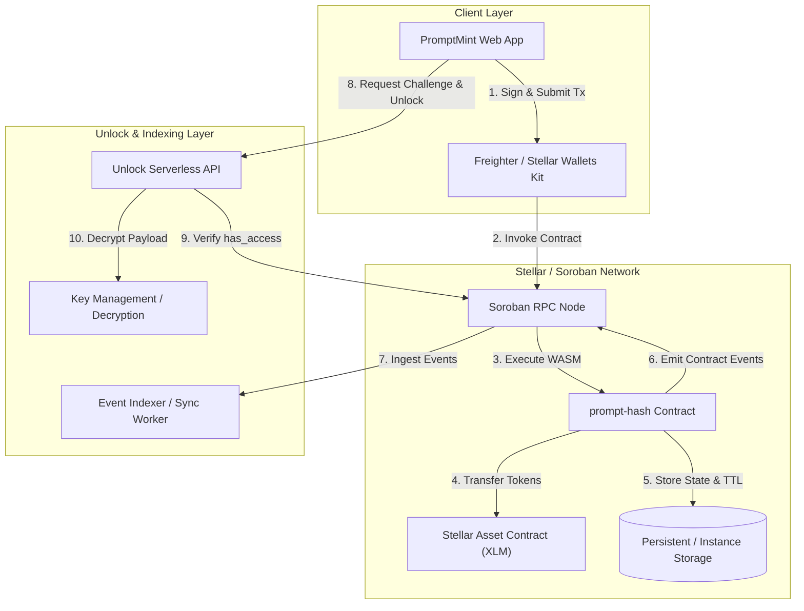
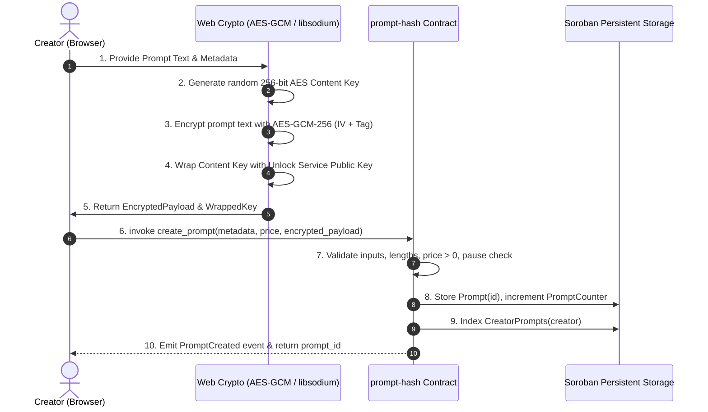
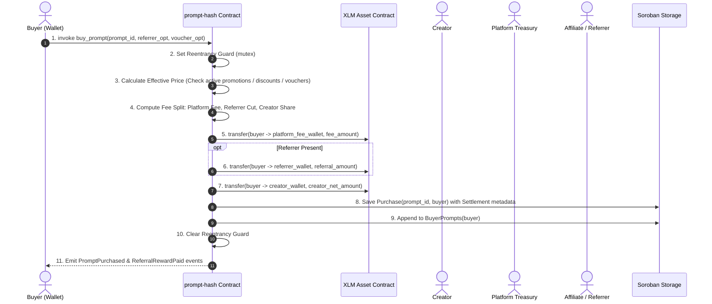
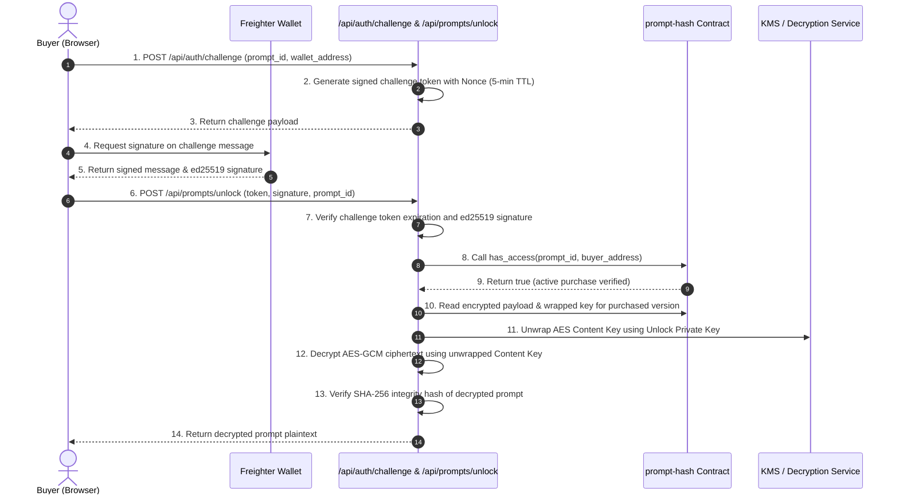
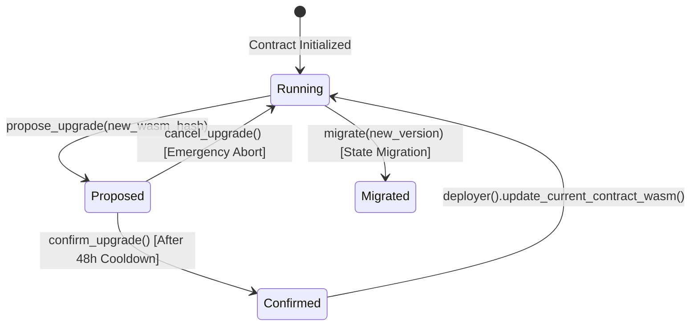

# Smart Contract Architecture Deep-Dive

## 1. Executive Summary & System Overview

The `prompt-hash` Soroban smart contract (`contracts/prompt-hash`) serves as the decentralized core of the PromptMint platform. It manages creator prompt listings, facilitates native XLM payments with automated platform and referral revenue splits, guarantees buyer entitlement and licensing rights, and enforces cryptographic payload integrity for wallet-verified unlocks.



---

## 2. Storage Layout & TTL Management

Soroban utilizes a state storage model categorized into **Persistent**, **Instance**, and **Temporary** storage. The `prompt-hash` contract manages operational state using Persistent and Instance storage with deterministic Time-To-Live (TTL) bump policies.

### 2.1 TTL Constants & Renewal Policy
State entries must remain active across ledger closes. The contract enforces proactive TTL extensions on every read and write:

```rust
pub const DAY_IN_LEDGERS: u32 = 17_280; // ~5 second ledger close time
pub const PERSISTENT_LIFETIME_THRESHOLD: u32 = 7 * DAY_IN_LEDGERS;  // 7 days (120,960 ledgers)
pub const PERSISTENT_BUMP_AMOUNT: u32 = 30 * DAY_IN_LEDGERS;         // 30 days (518,400 ledgers)
```

Whenever a storage key is accessed, `Storage::extend_key_ttl(env, &key)` inspects the remaining ledger lifetime. If the remaining lifetime is below `PERSISTENT_LIFETIME_THRESHOLD`, Soroban extends the entry to `PERSISTENT_BUMP_AMOUNT`.

### 2.2 Storage Keys Mapping (`DataKey`)

| Storage Scope | Key Name | Key Enum / Type | Stored Data Type | Description |
| :--- | :--- | :--- | :--- | :--- |
| **Instance** | Schema Version | `DataKey::SchemaVersion` | `u32` | Tracks contract schema migration level (e.g. v1, v2). |
| **Persistent**| Prompt Record | `DataKey::Prompt(u128)` | `Prompt` | Complete metadata, creator, pricing, and encryption headers. |
| **Persistent**| Prompt Counter | `DataKey::PromptCounter` | `u128` | Auto-incrementing global sequence counter for prompt IDs. |
| **Persistent**| Platform Fee BPS | `DataKey::FeePercentage` | `u32` | Marketplace take-rate represented in basis points (e.g. 250 = 2.5%). |
| **Persistent**| Fee Wallet | `DataKey::FeeWallet` | `Address` | Stellar address receiving platform fee cuts. |
| **Persistent**| XLM Address | `DataKey::XlmAddress` | `Address` | Stellar Asset Contract address for native XLM. |
| **Persistent**| Creator Prompts | `DataKey::CreatorPrompts(Address)`| `Vec<u128>` | Index of all prompt IDs published by a given creator address. |
| **Persistent**| Buyer Prompts | `DataKey::BuyerPrompts(Address)` | `Vec<u128>` | Index of all prompt IDs purchased/held by a buyer. |
| **Persistent**| Purchase Record | `DataKey::Purchase(u128, Address)`| `Purchase` | Entitlement record, price paid, settlement details, version. |
| **Persistent**| Reentrancy Lock | `DataKey::Reentrancy` | `bool` | Mutex guard preventing cross-call reentrancy during payouts. |
| **Persistent**| Pause Status | `DataKey::IsPaused` | `bool` | Emergency circuit-breaker switch. |
| **Persistent**| Initialized Flag| `DataKey::Initialized` | `bool` | Prevents constructor re-invocation. |
| **Persistent**| Referral BPS | `DataKey::ReferralPercentage` | `u32` | Default affiliate reward percentage in basis points. |
| **Persistent**| Referral Code | `DataKey::ReferralCode(BytesN<32>)`| `ReferralCode` | Hashed affiliate code linking to owner address and custom BPS. |
| **Persistent**| Referral Parent | `DataKey::ReferralParent(Address)`| `Address` | Sticky referrer attribution for a buyer. |
| **Persistent**| Voucher Discount| `DataKey::VoucherKey(u128, BytesN<32>)`| `u32` | Creator discount voucher code hash mapping to discount BPS. |
| **Persistent**| Bundle Record | `DataKey::Bundle(u128)` | `Bundle` | Multi-prompt bundle package record. |
| **Persistent**| Bundle Counter | `DataKey::BundleCounter` | `u128` | Auto-incrementing sequence counter for bundle IDs. |
| **Persistent**| Bundle Purchase | `DataKey::BundlePurchase(u128, Address)`| `BundlePurchase` | Entitlement record for purchased prompt bundles. |
| **Persistent**| Active Promotion| `DataKey::ActivePromotion(u128)`| `Promotion` | Current active time-bounded promotional price override. |
| **Persistent**| Promotion History| `DataKey::PromotionHistory(u128)`| `Vec<Promotion>` | Historical ledger of all promotions run on a listing. |
| **Persistent**| Time Discount | `DataKey::Discount(u128)` | `Discount` | Ledger-bounded price discount window. |
| **Persistent**| Creator Stake | `DataKey::CreatorStake(u128)` | `Stake` | Reputation deposit locked by creator against dispute/slashing. |
| **Persistent**| Classification | `DataKey::ClassificationOverride(u128)`| `ClassificationOverride`| Moderator-assigned safety category and flags. |
| **Persistent**| Moderator Addr | `DataKey::ModeratorAddress` | `Address` | Designated content moderation authority. |
| **Persistent**| Versioned Enc | `DataKey::PromptEncryptedPayload(u128, u32)`| `PromptEncryptedPayload`| Historical encrypted payloads for rotated key versions. |
| **Persistent**| Enc Version Count| `DataKey::PromptEncryptionVersion(u128)`| `u32` | Current encryption key rotation sequence number. |
| **Persistent**| Upgrade Proposed| `DataKey::PendingUpgrade` | `BytesN<32>` | New WASM bytecode hash proposed for contract upgrade. |
| **Persistent**| Upgrade Proposer| `DataKey::UpgradeProposer` | `Address` | Admin address that initiated the upgrade proposal. |
| **Persistent**| Upgrade Timestamp| `DataKey::UpgradeProposedAt` | `u64` | Unix timestamp of proposal for timelock cooldown check. |

---

## 3. Visual Data Flow Diagrams

### 3.1 Prompt Creation & Encryption Flow



### 3.2 Prompt Purchase & Revenue Distribution Flow



### 3.3 Prompt Unlock & Decryption Flow



---

## 4. Fee Calculation Engine & Revenue Splits

> **Canonical reference:** [Fee Model and Split Math](./fee-model-and-split-math.md) documents the exact stroop-level split between seller and platform, integer rounding rules, and worked examples aligned with `contract.rs`.

### 4.1 Basis Points Math Model
All percentages in the smart contract are represented as Basis Points (BPS), where $1 \text{ BPS} = 0.01\%$ and $10,000 \text{ BPS} = 100\%$.

Let:
- $P_{\text{raw}}$ = Base listing price in stroops ($1 \text{ XLM} = 10^7 \text{ stroops}$).
- $D_{\text{promo}}$ = Promotional or time-discounted price override.
- $V_{\text{bps}}$ = Voucher discount percentage (e.g. 1000 = 10%).
- $F_{\text{bps}}$ = Platform fee percentage (capped at `MAX_PLATFORM_FEE_BPS = 2000`, i.e., 20%).
- $R_{\text{bps}}$ = Referral reward percentage.

### 4.2 Effective Price Calculation
$$P_{\text{effective}} = \begin{cases} 
D_{\text{promo}} & \text{if active promotion or discount ledger window matches} \\
P_{\text{raw}} - \left( \frac{P_{\text{raw}} \times V_{\text{bps}}}{10000} \right) & \text{if voucher applied} \\
P_{\text{raw}} & \text{otherwise}
\end{cases}$$

### 4.3 Payout Breakdown
1. **Platform Fee** (integer division; fractional stroops are not collected):
   $$\text{Amount}_{\text{platform}} = \left\lfloor \frac{P_{\text{effective}} \times F_{\text{bps}}}{10000} \right\rfloor$$

2. **Referral Payout** (from full $P_{\text{effective}}$, not from creator share):
   $$\text{Amount}_{\text{referrer}} = \begin{cases}
   \left\lfloor \frac{P_{\text{effective}} \times R_{\text{bps}}}{10000} \right\rfloor & \text{if referrer is valid and not creator/buyer} \\
   0 & \text{otherwise}
   \end{cases}$$

3. **Co-Creator Revenue Splits** (each from full $P_{\text{effective}}$):
   If the prompt listing defines collaborator shares $(\alpha_1, \alpha_2, \dots, \alpha_k)$:
   $$\text{Share}_i = \left\lfloor \frac{P_{\text{effective}} \times \alpha_i}{10000} \right\rfloor$$

4. **Creator Net Proceeds** (absorbs all integer rounding remainder):
   $$\text{Amount}_{\text{creator}} = P_{\text{effective}} - \text{Amount}_{\text{platform}} - \text{Amount}_{\text{referrer}} - \sum \text{Share}_i$$

### 4.4 Arithmetic Overflow & Safety Guards
- All arithmetic uses Rust checked operations (`checked_add`, `checked_sub`, `checked_mul`, `checked_div`).
- Any calculation that overflows returns `Error::ArithmeticOverflow`.
- Payout amounts are strictly bounded so that:
  $$\text{Amount}_{\text{platform}} + \text{Amount}_{\text{referrer}} + \sum \text{Share}_i + \text{Amount}_{\text{creator}} = P_{\text{effective}}$$

---

## 5. Access Control Model & Security Architecture

### 5.1 Role-Based Access Matrix

| Role | Identifying Credential | Authorized Methods |
| :--- | :--- | :--- |
| **Contract Admin** | Pre-configured Admin Address | `set_fee_percentage`, `set_fee_wallet`, `set_xlm_address`, `pause`, `unpause`, `propose_upgrade`, `confirm_upgrade`, `cancel_upgrade`, `migrate` |
| **Content Moderator** | Moderator Address | `set_moderator_address`, `override_classification`, `slash_stake` |
| **Prompt Creator** | Cryptographic Owner (`creator.require_auth()`) | `create_prompt`, `update_prompt_price`, `set_prompt_sale_status`, `rotate_encryption`, `add_voucher`, `remove_voucher`, `create_promotion`, `cancel_promotion`, `deposit_stake`, `withdraw_stake` |
| **Buyer / Licensee**| Purchaser Address (`buyer.require_auth()`) | `buy_prompt`, `buy_bundle`, `renew_subscription`, `transfer_license`, `tip_prompt` |
| **Public / Anonymous**| Unauthenticated RPC Reader | `get_prompt`, `get_all_prompts`, `get_prompts_by_creator`, `get_prompts_by_buyer`, `has_access`, `get_bundle`, `get_stake` |

### 5.2 Reentrancy Guard
The contract prevents reentrancy attacks across token transfers using an explicit lock:
```rust
pub fn set_reentrancy_guard(env: &Env) -> Result<(), Error> {
    let key = DataKey::Reentrancy;
    let already_set = env.storage().persistent().get::<_, bool>(&key).unwrap_or(false);
    ensure(!already_set, Error::ReentrancyGuard)?;
    env.storage().persistent().set(&key, &true);
    Ok(())
}
```

### 5.3 Constructor Lock (`AlreadyInitialized`)
The contract setup routine records an immutable `DataKey::Initialized` flag. Re-running initialization against an active contract will immediately fail with `Error::AlreadyInitialized`.

---

## 6. Two-Step Contract Upgrade & Migration Framework

To protect users against instantaneous malicious or erroneous contract upgrades, `prompt-hash` enforces a two-step timelocked upgrade mechanism:



### 6.1 Upgrade Stages
1. **Proposal (`propose_upgrade`)**:
   - Only the admin can propose an upgrade with the SHA-256 hash of the uploaded WASM code.
   - The contract records `PendingUpgrade`, `UpgradeProposer`, and `UpgradeProposedAt = env.ledger().timestamp()`.
   - Emits `UpgradeProposed(new_wasm_hash, timestamp)`.
2. **Cooldown Period**:
   - A minimum timelock cooldown period (e.g. 48 hours / 172,800 seconds) must elapse before execution.
   - If `confirm_upgrade` is called before this cooldown expires, the transaction panics with `Error::UpgradeCooldownNotElapsed`.
3. **Execution (`confirm_upgrade`)**:
   - Verifies the proposer identity and elapsed cooldown.
   - Calls `env.deployer().update_current_contract_wasm(wasm_hash)` to atomically replace contract bytecode.
   - Clears pending upgrade state and emits `UpgradeConfirmed(wasm_hash, timestamp)`.
4. **Cancellation (`cancel_upgrade`)**:
   - If an issue is discovered with the proposed bytecode during the cooldown, the admin can cancel the proposal, clearing the pending upgrade slots and emitting `UpgradeCancelled`.

### 6.2 Schema Versioning & Migrations (`migrate`)
When a new WASM release alters the storage layout:
- `DataKey::SchemaVersion` stores the active schema revision (e.g., `1`).
- The admin invokes `migrate(new_version)` to execute iterative state translation logic.
- Emits `SchemaMigrated(previous_version, new_version)`.

---

## 7. Comprehensive Contract Event Schema

All events are defined using Soroban's `#[contractevent]` macro and published via `event.publish(env)`.

### 7.1 Marketplace Core Events

#### `PromptCreated`
- **Topics**: `[Symbol("PromptCreated"), prompt_id: u128]`
- **Data**: `{ creator: Address, price_stroops: i128, asset: Address }`
- **Trigger**: Emitted upon successful execution of `create_prompt`.

#### `PromptSaleStatusUpdated`
- **Topics**: `[Symbol("PromptSaleStatusUpdated"), prompt_id: u128]`
- **Data**: `{ active: bool }`
- **Trigger**: Emitted when creator pauses/resumes listing availability.

#### `PromptPriceUpdated`
- **Topics**: `[Symbol("PromptPriceUpdated"), prompt_id: u128]`
- **Data**: `{ price_stroops: i128 }`
- **Trigger**: Emitted when creator updates base listing price.

#### `PromptPurchased`
- **Topics**: `[Symbol("PromptPurchased"), prompt_id: u128]`
- **Data**: `{ buyer: Address, creator: Address, price_stroops: i128, referrer: Option<Address>, creator_amount: i128, platform_amount: i128, referrer_amount: i128 }`
- **Trigger**: Emitted upon successful settlement of a prompt purchase.

### 7.2 Affiliate & Voucher Events

#### `ReferralCodeRegistered`
- **Topics**: `[Symbol("ReferralCodeRegistered"), referrer: Address]`
- **Data**: `{ code_hash: BytesN<32>, reward_bps: u32 }`
- **Trigger**: Emitted when a creator or influencer registers a custom referral code.

#### `ReferralRewardPaid`
- **Topics**: `[Symbol("ReferralRewardPaid"), prompt_id: u128]`
- **Data**: `{ referrer: Address, buyer: Address, reward_amount: i128 }`
- **Trigger**: Emitted during purchase settlement when a referral bonus is routed.

#### `VoucherAdded` / `VoucherRemoved`
- **Topics**: `[Symbol("VoucherAdded"), prompt_id: u128]`
- **Data**: `{ hashed_code: BytesN<32>, discount_bps: u32 }`
- **Trigger**: Emitted when a creator attaches or deletes a promotional voucher discount.

### 7.3 Governance, Upgrades & Admin Events

#### `UpgradeProposed`
- **Topics**: `[Symbol("UpgradeProposed"), new_wasm_hash: BytesN<32>]`
- **Data**: `{ proposed_at: u64 }`
- **Trigger**: Admin initiates contract upgrade proposal.

#### `UpgradeConfirmed`
- **Topics**: `[Symbol("UpgradeConfirmed"), new_wasm_hash: BytesN<32>]`
- **Data**: `{ confirmed_at: u64 }`
- **Trigger**: Admin confirms and executes upgrade after timelock expiration.

#### `UpgradeCancelled`
- **Topics**: `[Symbol("UpgradeCancelled"), cancelled_wasm_hash: BytesN<32>]`
- **Data**: `()`
- **Trigger**: Admin cancels pending upgrade proposal.

#### `SchemaMigrated`
- **Topics**: `[Symbol("SchemaMigrated")]`
- **Data**: `{ previous_version: u32, new_version: u32 }`
- **Trigger**: Admin executes on-chain state schema migration.

#### `ContractPausedStateChanged`
- **Topics**: `[Symbol("ContractPausedStateChanged")]`
- **Data**: `{ is_paused: bool }`
- **Trigger**: Admin engages or disengages emergency pause switch.

#### `FeeUpdated` / `FeeWalletUpdated`
- **Topics**: `[Symbol("FeeUpdated"), new_fee_percentage: u32]`
- **Data**: `()` / `{ new_fee_wallet: Address }`
- **Trigger**: Admin adjusts platform fee BPS or destination treasury address.

### 7.4 Content Moderation & Reputation Events

#### `ClassificationSet` / `ClassificationOverridden`
- **Topics**: `[Symbol("ClassificationSet"), prompt_id: u128]`
- **Data**: `{ classification: String, safety_flags: Vec<String> }` / `{ moderator: Address, reason: String }`
- **Trigger**: Emitted when content is categorized by creator or overridden by moderator.

#### `StakeAdded` / `StakeSlashed` / `StakeWithdrawn`
- **Topics**: `[Symbol("StakeAdded"), prompt_id: u128]`
- **Data**: `{ creator: Address, amount: i128, total_staked: i128 }`
- **Trigger**: Creator deposits/withdraws reputation stake, or moderator slashes stake for policy violations.

---

## 8. Cross-Reference Index

- **High-level System Architecture**: [docs/architecture.md](./architecture.md)
- **Deployment Runbook**: [docs/operations/deployment-runbook.md](./operations/deployment-runbook.md)
- **Troubleshooting Manual**: [docs/troubleshooting.md](./troubleshooting.md)
- **Component Library Catalog**: [docs/component-library.md](./component-library.md)
