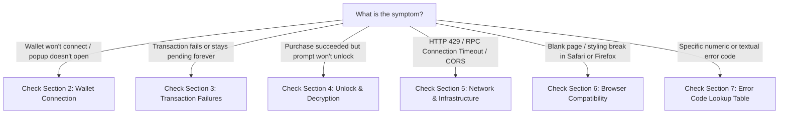

# PromptMint Developer & User Troubleshooting Guide

## Table of Contents
1. [Quick Diagnostic Decision Tree](#1-quick-diagnostic-decision-tree)
2. [Wallet Connection Problems](#2-wallet-connection-problems)
3. [Transaction Failures & Ledger Submission Errors](#3-transaction-failures--ledger-submission-errors)
4. [Unlock & Decryption Errors](#4-unlock--decryption-errors)
5. [Network & Infrastructure Issues](#5-network--infrastructure-issues)
6. [Browser & Platform Compatibility Matrix](#6-browser--platform-compatibility-matrix)
7. [Comprehensive Error Code Lookup Table](#7-comprehensive-error-code-lookup-table)
8. [Developer Debugging Tools & Techniques](#8-developer-debugging-tools--techniques)

---

## 1. Quick Diagnostic Decision Tree

Use this triage matrix to pinpoint issues in under 30 seconds:



---

## 2. Wallet Connection Problems

### 2.1 Freighter Wallet Fails to Connect
- **Symptoms**: Clicking "Connect Wallet" does nothing, or popup immediately closes.
- **Root Causes**:
  - Multiple wallet extensions installed (e.g., MetaMask, xBull, and Freighter competing for `window.stellar`).
  - Browser pop-up blocker preventing the extension window from opening.
  - Extension is locked or requires password authentication.
- **Step-by-Step Resolution**:
  1. Open the Freighter extension icon directly from your browser toolbar.
  2. Enter your password to unlock the extension.
  3. Ensure only Freighter (or your desired Stellar wallet) is active in `chrome://extensions` or `about:addons`.
  4. Disable aggressive third-party ad/script blockers on `promptmint.io`.
  5. Refresh the page (`Ctrl + Shift + R` or `Cmd + Shift + R`).

### 2.2 Network Mismatch Banner (Testnet vs Mainnet)
- **Symptoms**: App displays `Network Mismatch: Expected testnet, connected to PUBLIC`.
- **Root Causes**:
  - The wallet extension is configured to Stellar Mainnet (`PUBLIC`), but the application instance is connected to Testnet (or vice versa).
- **Resolution**:
  1. Open your wallet extension settings (gear icon).
  2. Navigate to **Network** settings.
  3. Select **Testnet** (Passphrase: `Test SDF Network ; September 2015`) for staging or **Public** for production.
  4. The `NetworkMismatchBanner` component will automatically clear once network IDs synchronize.

### 2.3 Mobile & Hardware Wallet Pairing
- **Symptoms**: WalletConnect QR code does not trigger mobile app signature.
- **Resolution**:
  1. Ensure your mobile wallet (e.g., Lobstr, Solar) is updated to the latest app version.
  2. Verify that the mobile device is on the same local network or has cellular data enabled.
  3. Clear stale WalletConnect pairings in your mobile wallet settings under **Connected Apps**.

---

## 3. Transaction Failures & Ledger Submission Errors

### 3.1 Insufficient XLM & Minimum Reserve Requirements
- **Symptoms**: Error message: `InsufficientBalance` or `txFAILED: op_underfunded`.
- **Explanation**:
  Stellar accounts require a base reserve of **1 XLM**, plus **0.5 XLM** for each subentry (trustlines, signers, open offers). You cannot spend this reserved balance.
- **Resolution**:
  1. Calculate your minimum spendable balance:
     $$\text{Available XLM} = \text{Total XLM} - (1.0 + 0.5 \times \text{Subentries}) - 0.01 \text{ (fee cushion)}$$
  2. Top up your account:
     - On Testnet: Request test XLM from the Stellar Laboratory Friendbot (`https://laboratory.stellar.org/#account-creator`).
     - On Mainnet: Transfer additional XLM from an exchange or funding wallet.

### 3.2 Bad Sequence Number (`txBAD_SEQ`)
- **Symptoms**: Transaction fails immediately with `txBAD_SEQ` or `Sequence number out of date`.
- **Root Causes**:
  - Multiple transactions submitted simultaneously from the same wallet address.
  - Local transaction sequence cache drifted from the Stellar Horizon node sequence.
- **Resolution**:
  1. Wait 10 seconds for prior in-flight transactions to settle.
  2. Refresh the PromptMint page to pull the latest on-chain sequence number.
  3. Resubmit the transaction.

### 3.3 Soroban Resource Limit & Footprint Errors
- **Symptoms**: Simulation error `HostError: ResourceLimitExceeded` or `FootprintMiss`.
- **Root Causes**:
  - The transaction reads or writes to ledger storage keys outside its declared footprint.
  - Contract execution exceeded maximum CPU or memory gas limits.
- **Resolution**:
  1. Ensure the transaction is pre-simulated using `sorobanClient.simulateTransaction()`.
  2. Ensure the TTL of the target prompt storage entry has not expired.

---

## 4. Unlock & Decryption Errors

### 4.1 "Challenge Token Expired" (`ERR_CHALLENGE_EXPIRED`)
- **Symptoms**: `/api/prompts/unlock` returns `401 Challenge token has expired`.
- **Explanation**:
  To protect against replay attacks, cryptographic challenge tokens have a strict **5-minute (300s) TTL**.
- **Resolution**:
  1. Click the "Retry Unlock" button in the `TransactionErrorBanner`.
  2. Promptly approve the signature prompt in your wallet extension.

### 4.2 "Invalid Wallet Signature" (`ERR_SIG_INVALID`)
- **Symptoms**: `/api/prompts/unlock` returns `401 Invalid wallet signature`.
- **Root Causes**:
  - The user switched active wallet addresses between requesting the challenge and signing it.
  - The wallet extension modified or truncated the challenge message.
- **Resolution**:
  1. Verify that the wallet address displayed in the top navigation bar matches the wallet address signing the request.
  2. Do not modify the challenge string inside the wallet popup.

### 4.3 Content Hash Integrity Mismatch (`ERR_HASH_MISMATCH`)
- **Symptoms**: Decryption succeeds, but UI alerts: `Integrity check failed: payload hash mismatch`.
- **Root Causes**:
  - The decrypted prompt text does not match the cryptographic SHA-256 hash recorded on-chain during `create_prompt`.
- **Resolution**:
  1. This indicates payload corruption or tampering.
  2. Escalate immediately to platform support with the Prompt ID and Transaction Hash.

### 4.4 "Access Denied / Not Purchased" (`ERR_NO_ACCESS`)
- **Symptoms**: `/api/prompts/unlock` returns `403 Prompt access has not been purchased`.
- **Root Causes**:
  - The purchase transaction was submitted but has not yet closed in the latest Stellar ledger (~5 seconds).
  - The purchase was made with a different wallet address.
- **Resolution**:
  1. Check your transaction on [Stellar Expert](https://stellar.expert) to confirm it is included in a ledger.
  2. Wait 10 seconds for the indexer and Soroban RPC node to synchronize.

---

## 5. Network & Infrastructure Issues

### 5.1 HTTP 429 "Too Many Requests" (Rate Limiting)
- **Symptoms**: API calls return status `429 Too Many Requests`.
- **Limits**:
  - Challenge generation: 10 requests per minute per IP.
  - Unlock attempts: 5 requests per minute per IP / Wallet.
- **Resolution**:
  1. Wait 60 seconds for the rate limit window to reset.
  2. Avoid rapid repetitive clicking on unlock or challenge triggers.

### 5.2 Soroban RPC Connection Timeout
- **Symptoms**: Browser console shows `FetchError: Failed to fetch from soroban-testnet.stellar.org`.
- **Resolution**:
  1. Check status on [Stellar Status Dashboard](https://status.stellar.org).
  2. Configure secondary RPC fallbacks in `src/lib/stellar/sorobanClient.ts`.

---

## 6. Browser & Platform Compatibility Matrix

| Browser / OS | Supported | Known Issues & Recommended Workarounds |
| :--- | :--- | :--- |
| **Google Chrome (Desktop)** | **Fully Supported** | Recommended browser for Freighter and xBull extensions. |
| **Brave Browser (Desktop)** | **Fully Supported** | Ensure "Brave Shields" allows popups from PromptMint. |
| **Mozilla Firefox (Desktop)**| **Fully Supported** | Ensure third-party cookies are not blocked in strict privacy mode. |
| **Apple Safari (macOS)** | **Supported** | Safari requires user interaction before opening wallet extension tabs. |
| **Microsoft Edge (Desktop)** | **Fully Supported** | Chromium-compatible; supports all Chrome Web Store extensions. |
| **iOS Safari (Mobile)** | **Supported (WalletConnect)**| Requires WalletConnect bridge to mobile wallet apps (Lobstr, Solar). |
| **Android Chrome (Mobile)** | **Supported (WalletConnect)**| Requires WalletConnect bridge or dApp browser. |
| **Incognito / Private Mode** | **Partial** | Browser extensions must be explicitly enabled in Incognito settings. |

---

## 7. Comprehensive Error Code Lookup Table

### 7.1 Smart Contract Error Codes (`prompt-hash`)

| Code | Variant Name | Root Cause | Immediate Resolution |
| :--- | :--- | :--- | :--- |
| `1` | `Unauthorized` | Caller is not authorized for this action (missing `require_auth` or admin check). | Verify caller wallet address and signature authority. |
| `2` | `PromptNotFound` | Prompt ID does not exist in persistent storage. | Check prompt ID parameter. |
| `3` | `CreatorCannotBuy` | Creator attempted to purchase their own prompt listing. | Purchase must be executed from a distinct buyer wallet. |
| `4` | `PromptInactive` | Prompt listing is disabled or marked inactive by creator. | Prompt creator must call `set_prompt_sale_status(true)`. |
| `5` | `AlreadyPurchased` | Buyer has already purchased and holds an active entitlement for this prompt. | Access prompt directly from "My Library"; do not repurchase. |
| `6` | `InvalidPrice` | Listing price is less than or equal to zero stroops. | Provide a positive price in stroops ($> 0$). |
| `7` | `InvalidFeePercentage` | Platform fee percentage exceeds allowed maximum (2000 BPS = 20%). | Set fee between 0 and 2000 BPS. |
| `8` | `InvalidFieldLength` | Input string (title, preview, URL, ciphertext) exceeds max byte limits. | Shorten prompt metadata field lengths. |
| `9` | `FeeWalletNotSet` | Platform fee treasury wallet has not been configured in contract. | Contract admin must call `set_fee_wallet(address)`. |
| `10`| `XlmAddressNotSet` | Native XLM Stellar Asset Contract address not configured. | Contract admin must call `set_xlm_address(address)`. |
| `11`| `ArithmeticOverflow` | Mathematical overflow detected during fee or split calculation. | Review price and split basis points. |
| `12`| `ReentrancyGuard` | Reentrancy mutex locked during active external invocation. | Avoid recursive contract calls. |
| `13`| `ContractIsPaused` | Contract is in emergency paused state. | Admin must call `unpause()` before operations can resume. |
| `14`| `ReferrerCannotBeBuyerOrCreator` | Referrer address matches either the buyer or creator. | Provide a distinct, independent referrer address. |
| `15`| `InvalidPaymentAmount` | Paid token amount does not match effective prompt price. | Ensure token balance covers full effective price. |
| `16`| `InvalidVoucher` | Discount voucher code hash not found or already expired. | Verify voucher code string. |
| `17`| `InvalidReferralPercentage` | Referral percentage exceeds allowed cap. | Ensure referral reward is within valid bounds. |
| `18`| `InvalidDiscountPercentage` | Discount percentage exceeds 10000 BPS (100%). | Set discount BPS between 1 and 10000. |
| `19`| `MaxSupplyReached` | Maximum edition supply cap reached for this listing. | Listing sold out. |
| `20`| `InvalidSplits` | Collaborator revenue split percentages do not sum to 10000 BPS. | Ensure all collaborator shares total exactly 10000 BPS. |
| `21`| `ListingExpired` | Listing has reached its configured expiry timestamp. | Creator must call `extend_listing(new_timestamp)`. |
| `22`| `LicenseNotFound` | No purchase entitlement found for buyer and prompt ID. | Complete purchase before attempting license operations. |
| `23`| `InvalidLicenseTransfer` | Attempted to transfer license to self or invalid address. | Specify a valid new owner address. |
| `24`| `ReferralCodeNotFound` | Hashed referral code does not exist in storage. | Register referral code before referencing. |
| `25`| `ReferralCodeAlreadyExists` | Referral code has already been registered by another user. | Choose a unique referral code. |
| `26`| `ReferralCodeTooShort` | Referral code length is below minimum required characters. | Use a referral code with at least 4 characters. |
| `27`| `ReferralReplay` | Referral reward already claimed for this purchase. | Referral payout is one-time per purchase. |
| `28`| `CircularReferral` | Buyer attempted to refer their own referrer in a cycle. | Referral chains must be acyclic. |
| `29`| `SubscriptionNotFound` | Creator has not configured an active subscription pass. | Creator must configure subscription parameters first. |
| `30`| `SubscriptionInactive` | Creator subscription pass has been deactivated. | Creator must re-activate subscription pass. |
| `31`| `InvalidSubscriptionConfig` | Subscription duration or price is invalid. | Duration must be $> 0$ and price $> 0$. |
| `32`| `InvalidClassification` | Unknown content classification category provided. | Choose from allowed taxonomy categories. |
| `33`| `InvalidDisclosureFlags` | Unrecognized safety disclosure flag string. | Use valid safety flag values. |
| `34`| `NotModerator` | Caller is not the designated content moderator address. | Only moderator address can override classification. |
| `35`| `InvalidPromotionTime` | Promotion start time is in the past or end time is before start time. | Ensure `end_time > start_time >= now`. |
| `36`| `PromotionOverlap` | Another promotion is already active during the requested window. | Cancel existing promotion or select a distinct time window. |
| `37`| `PromotionNotFound` | No active promotion found for prompt ID. | Check promotion ID. |
| `38`| `UnauthorizedPromotion` | Caller is not the prompt creator. | Only creator can manage promotional pricing. |
| `39`| `EncryptionVersionNotFound` | Encrypted payload for requested version was not archived. | Contact support or re-rotate encryption. |
| `40`| `VersionMismatch` | Stored schema version is newer than running contract code. | Upgrade contract code to match ledger schema version. |
| `41`| `FeeExceedsMaximum` | Proposed platform fee exceeds 2000 BPS ceiling. | Set fee percentage $\le 2000$ BPS. |
| `42`| `UpgradeAlreadyProposed` | An upgrade proposal is already pending in the cooldown queue. | Wait for confirmation or cancel existing proposal. |
| `43`| `UpgradeNotProposed` | No upgrade proposal exists to confirm or cancel. | Call `propose_upgrade` before `confirm_upgrade`. |
| `44`| `UpgradeCooldownNotElapsed` | Attempted to confirm upgrade before 48h cooldown expired. | Wait until timelock cooldown has elapsed. |
| `45`| `BundleNotFound` | Bundle ID does not exist in persistent storage. | Verify bundle ID parameter. |
| `46`| `KeyNotFound` | Storage key lookup failed unexpectedly. | Verify persistent entry exists and has not expired. |
| `47`| `StakeNotFound` | No creator reputation stake found for prompt ID. | Deposit stake via `deposit_stake`. |
| `48`| `StakeLocked` | Attempted to withdraw stake while locked in active dispute. | Wait for dispute resolution before withdrawing stake. |
| `49`| `InvalidStakeAmount` | Stake deposit amount is less than minimum required. | Deposit at least minimum required stake. |
| `50`| `NotStakeOwner` | Caller is not the creator who deposited the stake. | Only depositor can withdraw stake. |
| `51`| `AlreadyInitialized` | Contract setup constructor has already been executed. | Constructor cannot be re-invoked. |

### 7.2 Client & HTTP Error Codes

| Error Code | HTTP Status | Description | Actionable Fix |
| :--- | :--- | :--- | :--- |
| `ERR_WALLET_REJECTED` | Client | User clicked "Cancel" or "Reject" in wallet popup. | User must click "Approve" / "Sign" in wallet. |
| `ERR_INSUFFICIENT_FEE` | Client | Account has insufficient XLM for gas fees. | Top up at least 0.1 XLM for transaction fees. |
| `ERR_CHALLENGE_EXPIRED` | `401` | Challenge token TTL (5m) expired before signing. | Click "Retry" to obtain a fresh challenge token. |
| `ERR_SIG_INVALID` | `401` | Cryptographic signature verification failed. | Re-connect wallet and sign exact message without modifications. |
| `ERR_NO_ACCESS` | `403` | On-chain purchase entitlement check returned false. | Confirm purchase transaction on Stellar Expert. |
| `ERR_DECRYPT_FAILED` | `500` | AES-GCM decryption failed (corrupted ciphertext). | Re-upload prompt with fresh encryption key. |
| `ERR_RATE_LIMITED` | `429` | IP or wallet exceeded rate limits. | Wait 60 seconds before retrying. |

---

## 8. Developer Debugging Tools & Techniques

### 8.1 Inspecting Contract State via Stellar CLI
```bash
# Read specific prompt data
stellar contract invoke \
  --id "$CONTRACT_ID" \
  --network testnet \
  -- get_prompt \
  --prompt_id 0

# Check access status for a buyer
stellar contract invoke \
  --id "$CONTRACT_ID" \
  --network testnet \
  -- has_access \
  --prompt_id 0 \
  --buyer "$BUYER_ADDRESS"
```

### 8.2 Testing Unlock Flow with Synthetic Scripts
Run the end-to-end synthetic unlock test:
```bash
npm run test:synthetic
```

### 8.3 Browser Console Diagnostics
Open Chrome DevTools (`F12`), navigate to **Console**, and run:
```javascript
// Check connected wallet provider
console.log(window.stellar);

// Verify Web Crypto API support
console.log(window.crypto && window.crypto.subtle ? "WebCrypto OK" : "WebCrypto Unavailable");
```

### 8.4 Failed Vercel Deployment Rollback Runbook

Use this runbook when a production deployment fails or auto-rolls back in Vercel.

#### Reading Deployment Failure Logs

1. Open the Vercel project dashboard and go to **Deployments**.
2. Select the failed deployment (marked with a red **Error** badge).
3. Click **Inspect Deployment** and open the **Build Logs** tab.
4. Search for `Error:`, `Failed to compile`, or `Command exited with code` to find the root cause.
5. For runtime failures after the build succeeds, open the **Runtime Logs** tab and filter by the failing deployment.

#### Rolling Back to the Last Known Good Deployment

1. In the **Deployments** tab, identify the most recent deployment with a green **Ready** badge.
2. Click the overflow menu (three dots) on that deployment and choose **Promote to Production** (or **Redeploy** for the same production URL).
3. Confirm the promotion in the dialog and wait for the promotion to complete.
4. Verify the production URL returns HTTP 200 and the application loads in the browser.
5. If the rollback itself fails, create a GitHub issue tagged `runbook:vercel-rollback` with the failed deployment URL, build log excerpt, and target deployment hash.
